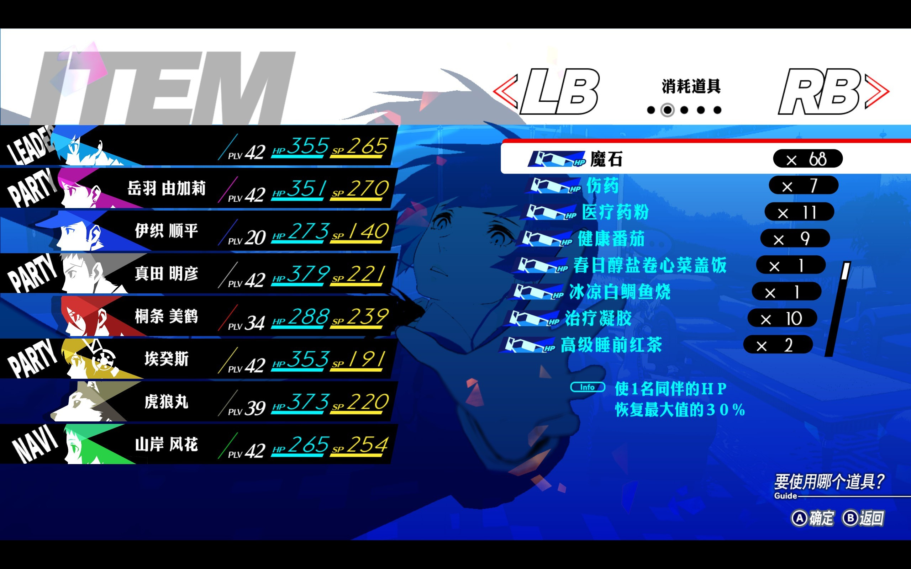
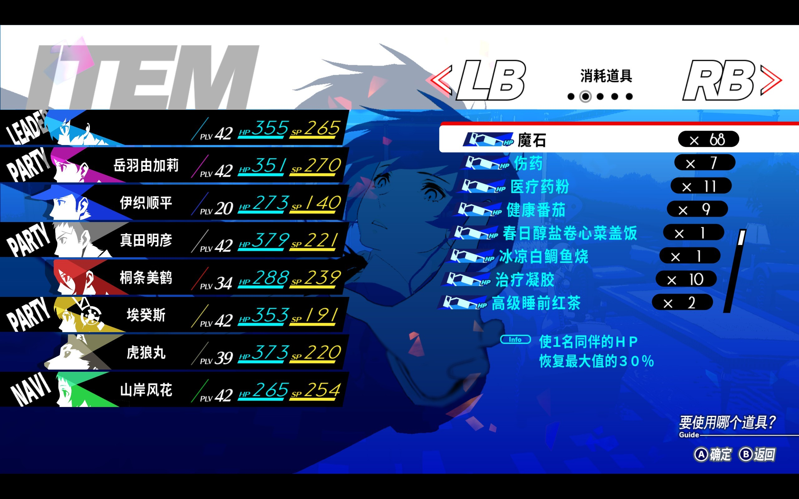
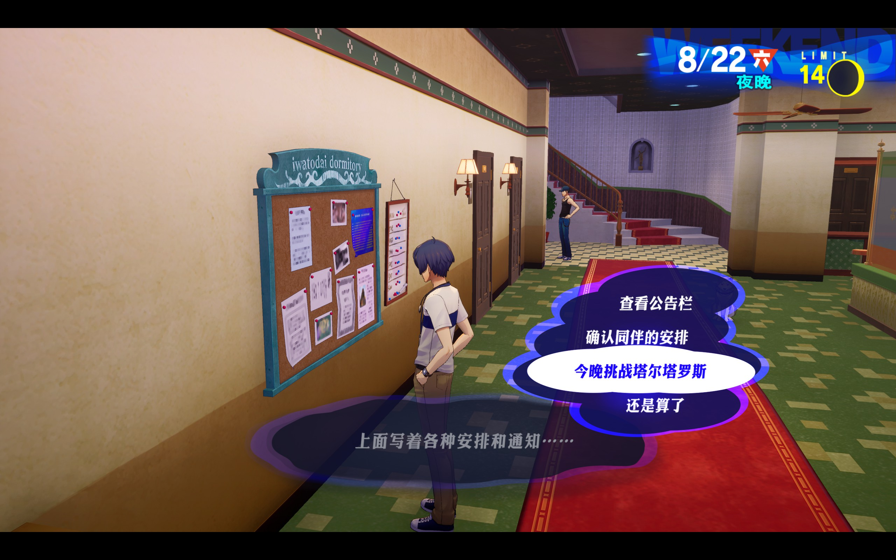
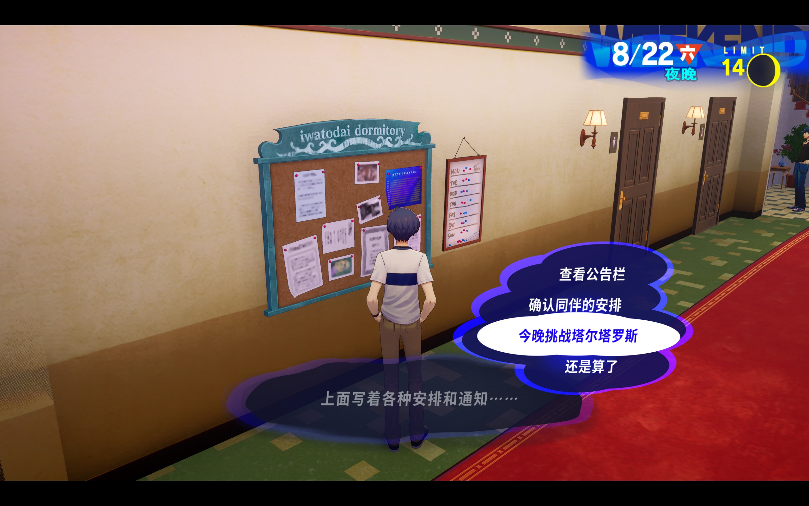
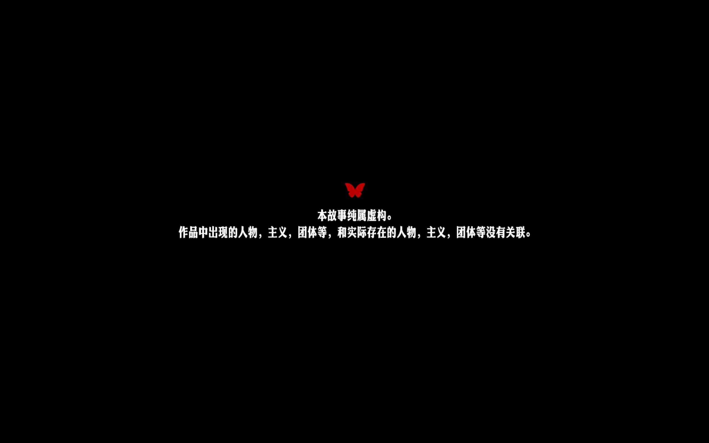
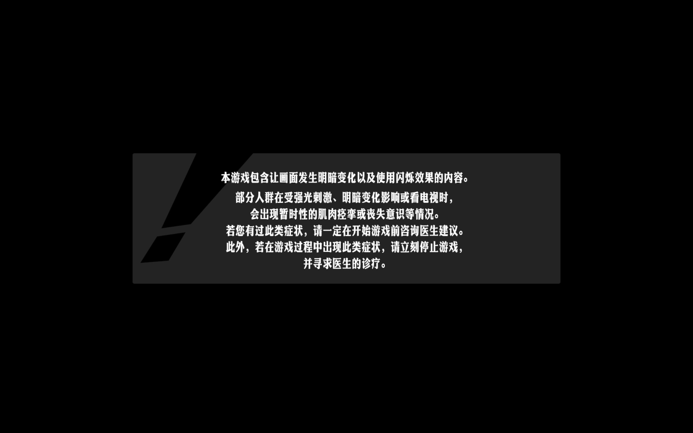
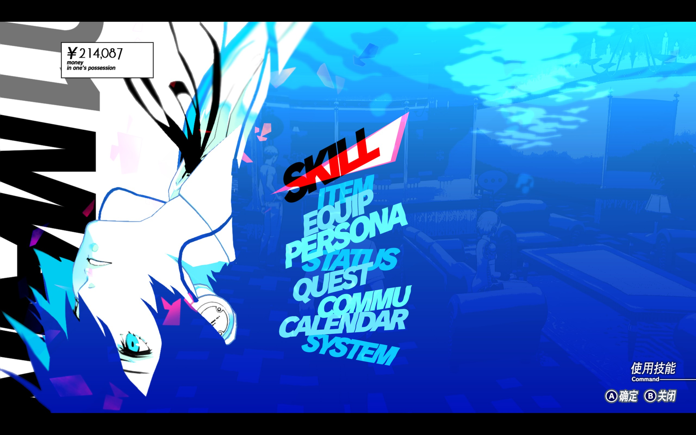

# 更好的简体中文字体

此模组将替换游戏内的简体中文字体，字体为[思源黑体](https://github.com/adobe-fonts/source-han-sans)。

## 使用方法

使用[Reloaded-II](https://github.com/Reloaded-Project/Reloaded-II)来注入游戏，模组的前置还需要[Persona 3 Reload Essentials](https://gamebanana.com/mods/494020)。

## 效果图

| 替换前                                         | 替换后                                         |
| ---------------------------------------------- | ---------------------------------------------- |
|  |  |
|  |  |
|  |  |

此模组的替换也不是十全十美的，有些字体还是替换不了，例如右上角的“夜晚”，游戏开头的两个警告等等。

我不清楚是硬编码还是其它什么原因，我甚至替换了所有的字体文件但还是那样，所以就算了吧。







## 替换原理

将想要替换的字体重命名为 `DFGBJH8.ufont`来替换文件。

```
UnrealEssentials\P3R\Content\Xrd777\Font\DFGBJH8.ufont
```

字体配置路径，不同的语言目录也不一样，例如简体中文的是 `zh-Hans`文件夹。

```
UnrealEssentials\P3R\Content\L10N\zh-Hans\Xrd777\Font\FSA_FontStyle.uasset
```
